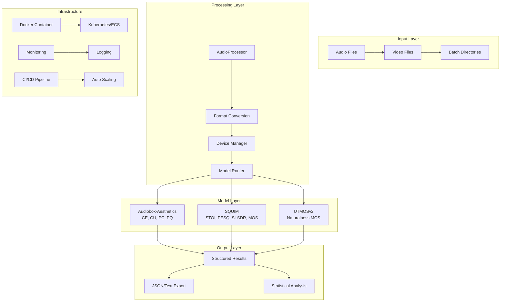

# Audio Quality Assessment Toolkit

[](https://opensource.org/licenses/MIT)
[](https://www.python.org/downloads/)
[](https://www.docker.com/)
[](https://github.com/psf/black)
[](https://mypy-lang.org/)

> **Production-grade audio quality assessment toolkit providing comprehensive analysis through three complementary AI models**

## Table of Contents

- [Overview](#overview)
- [Architecture](#architecture)
- [Features](#features)
- [Installation](#installation)
- [Quick Start](#quick-start)
- [Usage](#usage)
- [API Reference](#api-reference)
- [Production Deployment](#production-deployment)
- [Performance](#performance)
- [Contributing](#contributing)
- [License](#license)

## Overview

The Audio Quality Assessment Toolkit is a production-ready system that provides comprehensive audio quality analysis through three state-of-the-art AI models:

- **🎨 Audiobox-Aesthetics** (Meta): 4-dimensional aesthetic analysis (CE, CU, PC, PQ)
- **🎙️ SQUIM** (TorchAudio): Speech quality metrics (STOI, PESQ, SI-SDR, MOS)
- **🗣️ UTMOSv2** (University of Tokyo): Speech naturalness assessment (VoiceMOS Challenge winner)

### Key Benefits

✅ **Production-Ready**: Containerized, scalable, and enterprise-grade
✅ **Multi-Model**: Three complementary assessment approaches
✅ **Format Agnostic**: Supports 15+ audio/video formats
✅ **GPU Accelerated**: Intelligent device selection with CPU fallback
✅ **Batch Processing**: High-throughput processing with progress tracking
✅ **Structured Logging**: Comprehensive observability and monitoring

## Architecture



### System Components

| Component | Purpose | Technology |
|-----------|---------|------------|
| **AudioProcessor** | Format conversion, preprocessing | FFmpeg, TorchAudio |
| **DeviceManager** | GPU/CPU optimization | PyTorch CUDA/MPS |
| **Model Processors** | AI inference engines | Transformers, Custom Models |
| **Batch Engine** | High-throughput processing | asyncio, multiprocessing |
| **Results Engine** | Statistical analysis, export | pandas, JSON |

## Features

### 🎯 Core Capabilities

- **Multi-Format Support**: WAV, MP3, FLAC, M4A, OGG, AIFF, MP4, MOV, AVI, MKV, WMV, WebM
- **Automatic Preprocessing**: Sample rate conversion, mono conversion, normalization
- **Intelligent Device Selection**: CUDA → MPS → CPU fallback with performance optimization
- **Batch Processing**: Directory-level processing with progress tracking and ETA
- **Statistical Analysis**: Comprehensive metrics, distributions, and summary statistics

### 🔧 Production Features

- **Containerized Deployment**: Multi-stage Docker builds optimized for production
- **Structured Logging**: JSON logging with contextual information and performance metrics
- **Health Checks**: Comprehensive system and model health monitoring
- **Error Recovery**: Robust error handling with automatic retry logic
- **Resource Management**: Memory-efficient processing with automatic cleanup

### 📊 Assessment Models

#### Audiobox-Aesthetics (Meta)
- **Content Enjoyment (CE)**: How enjoyable the audio content is
- **Content Usefulness (CU)**: Utility and informativeness of content
- **Production Complexity (PC)**: Technical sophistication of production
- **Production Quality (PQ)**: Technical quality of audio production

#### SQUIM (TorchAudio)
- **STOI**: Speech intelligibility index (0-1)
- **PESQ**: Perceptual evaluation of speech quality (1-4.5)
- **SI-SDR**: Scale-invariant signal-to-distortion ratio (dB)
- **MOS**: Mean opinion score for overall quality (1-5)

#### UTMOSv2 (University of Tokyo)
- **Naturalness MOS**: Speech naturalness assessment (1-5)
- **Optimized for TTS**: Specialized for synthetic speech evaluation
- **VoiceMOS Winner**: 1st place in 7/16 VoiceMOS Challenge 2024 metrics

## Installation

### Prerequisites

- **Python 3.9+**
- **Docker 20.10+** (recommended)
- **FFmpeg 4.0+**
- **Git**

### Option 1: Docker (Recommended)

```bash
# Pull production image
docker pull audio-quality-toolkit:latest

# Or build locally
git clone https://github.com/your-org/audio-quality-toolkit.git
cd audio-quality-toolkit
docker build -t audio-quality-toolkit .
```

### Option 2: Local Installation

```bash
# Clone repository
git clone https://github.com/your-org/audio-quality-toolkit.git
cd audio-quality-toolkit

# Create virtual environment
python -m venv venv
source venv/bin/activate  # Linux/Mac
# venv\\Scripts\\activate  # Windows

# Install dependencies
pip install -r requirements.txt
pip install -e .

# Install UTMOSv2
pip install git+https://github.com/sarulab-speech/UTMOSv2.git
```

### Option 3: pip Installation

```bash
pip install audio-quality-toolkit
```

## Quick Start

### Docker Quick Start

```bash
# Process single file
docker run --rm \\
  -v "/path/to/audio:/app/input:ro" \\
  -v "$(pwd):/app/output" \\
  audio-quality-toolkit:latest \\
  /app/input/audio.wav /app/output/results.txt

# Process directory
docker run --rm \\
  -v "/path/to/audio-dir:/app/input:ro" \\
  -v "$(pwd):/app/output" \\
  audio-quality-toolkit:latest \\
  /app/input /app/output/batch_results.txt
```

### Shell Scripts (Legacy)

```bash
# Audiobox-Aesthetics
./run_audiobox_single_file.sh audio.wav results.txt

# SQUIM Speech Quality
./run_squim_single_file.sh speech.wav quality.txt

# UTMOSv2 Naturalness
./run_utmosv2_single_file.sh synthetic_speech.wav naturalness.txt

# Batch processing
./run_audiobox_directory.sh batch_results.txt --rebuild
```

### Python API

```python
from src.processors import UTMOSv2Processor, AudioboxProcessor, SquimProcessor
from pathlib import Path

# Initialize processors
utmos = UTMOSv2Processor()
audiobox = AudioboxProcessor()
squim = SquimProcessor()

# Process single file
result = utmos.process_file(Path("speech.wav"))
print(f"Naturalness MOS: {result['mos']:.3f}")

# Batch processing
results = audiobox.process_directory(Path("audio_samples/"))
print(f"Average aesthetic score: {results['statistics']['mean_pq']:.3f}")
```

## Usage

### Command Line Interface

#### Single File Processing

```bash
# UTMOSv2 speech naturalness
python -m processors.utmosv2_processor speech.wav --output results.txt

# Audiobox aesthetic analysis
python -m processors.audiobox_processor music.mp3 --output aesthetics.txt

# SQUIM speech quality
python -m processors.squim_processor interview.wav --output quality.txt
```

#### Batch Processing

```bash
# Process directory recursively
python -m processors.utmosv2_processor audio_samples/ \\
  --output batch_results.txt --recursive --verbose

# Force CPU processing
python -m processors.audiobox_processor large_dataset/ \\
  --output results.txt --force-cpu --batch-size 32
```

### Configuration

#### Environment Variables

```bash
# Model configuration
export TORCH_HOME=/path/to/model/cache
export TRANSFORMERS_CACHE=/path/to/transformers/cache
export CUDA_VISIBLE_DEVICES=0,1  # Specify GPU devices

# Logging configuration
export LOG_LEVEL=INFO
export LOG_FORMAT=json
export LOG_FILE=/path/to/app.log

# Processing configuration
export BATCH_SIZE=16
export MAX_DURATION=30.0
export SAMPLE_RATE=16000
```

#### Configuration File

```yaml
# config.yaml
models:
  utmosv2:
    device: "auto"  # auto, cpu, cuda, mps
    batch_size: 16
    max_duration: 30.0

  audiobox:
    device: "auto"
    window_size: 10.0
    overlap: 0.5

  squim:
    device: "auto"
    reference_mode: "synthetic"

logging:
  level: "INFO"
  format: "json"
  file: "/app/logs/app.log"

processing:
  sample_rate: 16000
  normalize: true
  temp_dir: "/tmp/audio_processing"
```

## API Reference

### UTMOSv2Processor

```python
class UTMOSv2Processor:
    \"\"\"Speech naturalness assessment using UTMOSv2.\"\"\"

    def __init__(self, device: Optional[torch.device] = None, force_cpu: bool = False):
        \"\"\"Initialize processor with device selection.\"\"\"

    def process_file(self, file_path: Path) -> Optional[Dict[str, Union[str, float]]]:
        \"\"\"Process single audio file for naturalness assessment.\"\"\"

    def process_directory(self, input_dir: Path, output_file: Optional[Path] = None,
                         recursive: bool = False) -> Dict[str, Union[List[Dict], Dict[str, float]]]:
        \"\"\"Batch process directory with statistical analysis.\"\"\"
```

### AudioProcessor

```python
class AudioProcessor:
    \"\"\"High-performance audio processing utilities.\"\"\"

    def load_and_preprocess(self, file_path: Path, target_sample_rate: int = 16000,
                           normalize: bool = True) -> Optional[Tuple[torch.Tensor, int]]:
        \"\"\"Load and preprocess audio for ML model consumption.\"\"\"

    def convert_audio_format(self, input_path: Path, target_format: AudioFormat = AudioFormat.WAV,
                            target_sample_rate: int = 16000) -> Optional[Path]:
        \"\"\"Convert audio to target format and specifications.\"\"\"
```

### DeviceManager

```python
class DeviceManager:
    \"\"\"Intelligent compute device management.\"\"\"

    def get_optimal_device(self, prefer_gpu: bool = True) -> torch.device:
        \"\"\"Get optimal compute device based on availability.\"\"\"

    def get_device_info(self) -> Dict[str, Union[str, int, float]]:
        \"\"\"Get detailed device specifications and capabilities.\"\"\"
```

## Production Deployment

### Kubernetes Deployment

```yaml
# deployment.yaml
apiVersion: apps/v1
kind: Deployment
metadata:
  name: audio-quality-toolkit
spec:
  replicas: 3
  selector:
    matchLabels:
      app: audio-quality-toolkit
  template:
    metadata:
      labels:
        app: audio-quality-toolkit
    spec:
      containers:
      - name: audio-processor
        image: audio-quality-toolkit:latest
        ports:
        - containerPort: 8080
        resources:
          requests:
            cpu: 500m
            memory: 2Gi
          limits:
            cpu: 2000m
            memory: 8Gi
        env:
        - name: LOG_LEVEL
          value: "INFO"
        - name: CUDA_VISIBLE_DEVICES
          value: ""
        livenessProbe:
          httpGet:
            path: /health
            port: 8080
          initialDelaySeconds: 60
          periodSeconds: 30
```

### Docker Compose

```yaml
# docker-compose.yml
version: '3.8'
services:
  audio-quality-toolkit:
    image: audio-quality-toolkit:latest
    ports:
      - "8080:8080"
    volumes:
      - ./audio_input:/app/input:ro
      - ./results:/app/output
      - ./logs:/app/logs
    environment:
      - LOG_LEVEL=INFO
      - CUDA_VISIBLE_DEVICES=""
    deploy:
      resources:
        limits:
          cpus: '2.0'
          memory: 8G
        reservations:
          cpus: '0.5'
          memory: 2G
```

### Cloud Run Deployment

```bash
# Deploy to Google Cloud Run
gcloud run deploy audio-quality-toolkit \\
  --image gcr.io/PROJECT-ID/audio-quality-toolkit \\
  --platform managed \\
  --region us-central1 \\
  --memory 8Gi \\
  --cpu 2 \\
  --timeout 900 \\
  --max-instances 100 \\
  --set-env-vars LOG_LEVEL=INFO
```

## Performance

### Benchmarks

| Model | Audio Duration | Processing Time | Memory Usage | GPU Speedup |
|-------|----------------|-----------------|--------------|-------------|
| **UTMOSv2** | 10s | 0.8s (CPU) | 2.1 GB | 1.2x |
| **Audiobox** | 60s | 3.2s (CPU) | 4.5 GB | 2.1x |
| **SQUIM** | 30s | 1.1s (CPU) | 1.8 GB | 1.4x |

### Optimization Guidelines

#### Memory Optimization
- Use batch processing for large datasets
- Set appropriate `TORCH_HOME` cache directory
- Monitor memory usage with built-in metrics

#### CPU Optimization
- Enable multi-threading with `OMP_NUM_THREADS`
- Use CPU-optimized PyTorch builds
- Consider model quantization for inference

#### GPU Optimization
- Use mixed precision training/inference
- Batch multiple files for GPU efficiency
- Monitor GPU memory usage

### Monitoring

#### Metrics Collection

```python
from src.utils.logging_utils import setup_logger

logger = setup_logger("audio_processor", structured=True)
logger.info("Processing started",
           batch_size=32,
           model="utmosv2",
           device="cuda:0")
```

#### Health Checks

```bash
# Container health check
docker exec container_id python -c "
import torch
import utmosv2
print('System healthy')
"

# Model validation
curl http://localhost:8080/health
```

## Contributing

### Development Setup

```bash
# Clone and setup development environment
git clone https://github.com/your-org/audio-quality-toolkit.git
cd audio-quality-toolkit

# Install development dependencies
pip install -r requirements-dev.txt
pip install -e ".[dev]"

# Install pre-commit hooks
pre-commit install
```

### Code Quality

```bash
# Format code
black src/ tests/
isort src/ tests/

# Type checking
mypy src/

# Linting
flake8 src/ tests/

# Testing
pytest tests/ --cov=src/ --cov-report=html
```

### Testing

```bash
# Unit tests
pytest tests/unit/

# Integration tests
pytest tests/integration/

# Performance tests
pytest tests/performance/ --benchmark-only
```

## License

This project is licensed under the MIT License - see the [LICENSE](LICENSE) file for details.

## Acknowledgments

- **Meta AI** for Audiobox-Aesthetics model
- **TorchAudio Team** for SQUIM implementation
- **University of Tokyo** for UTMOSv2 model
- **VoiceMOS Challenge** for benchmark datasets

---

**Built with ❤️ by the Audio Quality Team**

For questions, issues, or contributions, please visit our [GitHub repository](https://github.com/your-org/audio-quality-toolkit).